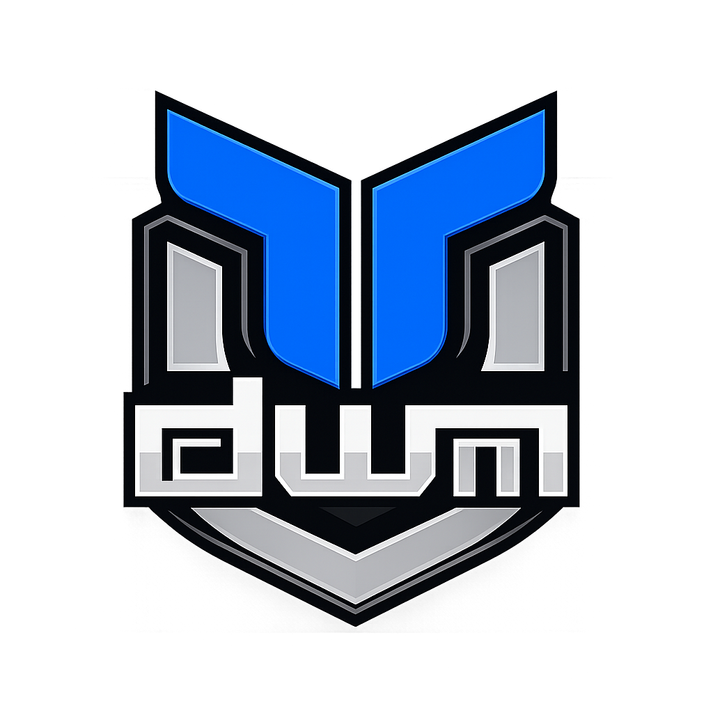
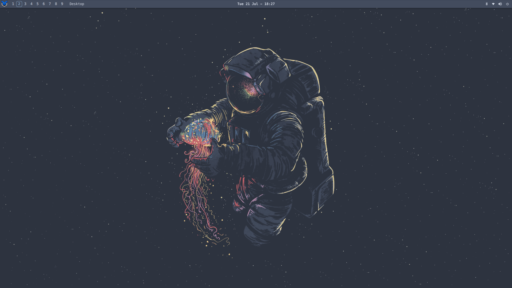

<div align="center">
  
  <h1>dwm-titus</h1>
  <p><strong>A fast, focused Linux desktop built for keyboard-driven work.</strong></p>
  <p>
    <a href="https://dwm.christitus.com">Documentation</a> |
    <a href="https://github.com/ChrisTitusTech/dwm-titus/releases/latest">Latest release</a> |
    <a href="./CHANGELOG.md">Changelog</a> |
    <a href="./CONTRIBUTING.md">Contributing</a>
  </p>
</div>



dwm-titus is a complete, lightweight X11 desktop with sensible defaults,
guided installation, and powerful customization. It is designed for people who
want a responsive keyboard-first workflow without having to assemble every
part themselves.

Fedora is the primary desktop image. The existing-system installer also
supports the core experience on Debian-, Arch-, Fedora-, and RHEL-family
distributions.

## What You Get

| Experience | What it includes |
| --- | --- |
| **A focused desktop** | Automatic window tiling, nine workspaces, fast keyboard navigation, multi-monitor support, and flexible fullscreen modes. |
| **Everyday essentials** | A polished panel, application launcher, system tray, Control Center, Settings, notifications, screenshots, audio, brightness, and power controls. |
| **Easy discovery** | An interactive keybind viewer, guided display setup, built-in diagnostics, and clear unsupported-feature reporting. |
| **Personal configuration** | Live-reloading hotkeys, themes, and window rules, with local configuration preserved across upgrades. |
| **Two installation paths** | A ready-to-install Fedora image or an installer for an existing supported Linux system. |

> dwm-titus is an X11 desktop. A Wayland-native session is not currently part
> of the project scope.

## Install

Choose the path that matches your system:

| Installation | Best for | What it does |
| --- | --- | --- |
| [Fedora ISO](#fedora-iso) | A fresh, dedicated installation | Installs the complete Fedora-first desktop from bootable media. |
| [Existing system](#existing-system) | A supported Linux installation you already use | Installs dependencies, the desktop session, and the selected feature set while preserving local configuration. |

For complete requirements and installation details, see the
[Installation Guide](https://dwm.christitus.com/install.html).

### Fedora ISO

Download the latest image:

| Image | Download |
| --- | --- |
| Standard | [`dwm-titus.iso`](https://github.com/ChrisTitusTech/dwm-titus/releases/latest/download/dwm-titus.iso) |
| NVIDIA | [`dwm-titus-nvidia.iso`](https://github.com/ChrisTitusTech/dwm-titus/releases/latest/download/dwm-titus-nvidia.iso) |
| Checksums and release notes | [Latest release](https://github.com/ChrisTitusTech/dwm-titus/releases/latest) |

Use the NVIDIA image only for systems that need the dedicated NVIDIA
installation path. Write the selected ISO to a USB drive, boot it, complete the
Fedora installer, and reboot into the `dwm` session.

### Existing System

```bash
git clone https://github.com/ChrisTitusTech/dwm-titus.git
cd dwm-titus

./install.sh --dry-run --non-interactive --profile recommended
./install.sh --profile recommended
```

The dry run shows the dependency and installation plan before anything changes.
The installer detects your distribution family, preserves existing personal
configuration, and installs the managed desktop components.

| Profile | Includes |
| --- | --- |
| `core` | The X11 session, required dependencies, and one terminal. |
| `recommended` | The complete everyday desktop, including Quickshell, theming, screenshots, audio, and brightness tools. |
| `full` | The recommended desktop plus optional file-manager, portal, keyring, wallpaper, display-manager, and supported Fedora gaming integrations. |

## First Login

**Super** is the Windows key on most keyboards.

| Action | Keybind |
| --- | --- |
| Open the application launcher | <kbd>Super</kbd> + <kbd>R</kbd> |
| Open a terminal | <kbd>Super</kbd> + <kbd>X</kbd> |
| Open Control Center | <kbd>Super</kbd> + <kbd>F1</kbd> |
| Show the interactive keybind viewer | <kbd>Super</kbd> + <kbd>/</kbd> |
| Close the focused window | <kbd>Super</kbd> + <kbd>Q</kbd> |
| Switch workspace | <kbd>Super</kbd> + <kbd>1-9</kbd> |
| Open the power menu | <kbd>Super</kbd> + <kbd>Ctrl</kbd> + <kbd>Q</kbd> |

With a display manager, select the `dwm` session when logging in. From a TTY,
start the session with:

```bash
startx
```

## Customize Your Desktop

Most personal settings live under:

```text
${XDG_CONFIG_HOME:-$HOME/.config}/dwm-titus/
```

Hotkeys, themes, and window rules reload when their TOML files are saved.
Advanced compile-time preferences live in the user-owned `config.h`, which the
installer and future upgrades preserve.

See the [Configuration Guide](https://dwm.christitus.com/configuration.html)
and [Theming Guide](https://dwm.christitus.com/theming.html) for examples and
safe customization paths.

## Documentation

- [Installation](https://dwm.christitus.com/install.html)
- [Getting Started](https://dwm.christitus.com/getting-started.html)
- [Keybindings](https://dwm.christitus.com/keybinds.html)
- [Configuration](https://dwm.christitus.com/configuration.html)
- [Theming](https://dwm.christitus.com/theming.html)
- [Control Center](https://dwm.christitus.com/control-center.html)
- [Settings](https://dwm.christitus.com/settings.html)
- [How dwm-titus Works](https://dwm.christitus.com/patches.html)
- [Troubleshooting](https://dwm.christitus.com/troubleshooting.html)

The technical guide explains the project architecture, what dwm is, and how
the maintained enhancements fit together. You do not need to understand or
apply dwm patches to install and use the desktop.

## Troubleshooting

Start with the built-in diagnostic report:

```bash
dwm-diagnostics
```

You can also open **Control Center -> System Health** for a graphical overview.
If the session does not start, run `startx` from a TTY to see its error output.
The [Troubleshooting Guide](https://dwm.christitus.com/troubleshooting.html)
covers common session, panel, terminal, theme, display, and NVIDIA issues.

If the problem remains, [open an issue](https://github.com/ChrisTitusTech/dwm-titus/issues)
and include the relevant diagnostic output. Review it first and remove any
private system information.

## Contributing

Contributions are welcome. Read [CONTRIBUTING.md](CONTRIBUTING.md) for the
development workflow and validation requirements, and report security issues
using [SECURITY.md](SECURITY.md).

The main repository check is:

```bash
make check
```

Project requirements and active work are tracked in [SPEC.md](SPEC.md),
[ROADMAP.md](ROADMAP.md), and [TASKS.md](TASKS.md).
