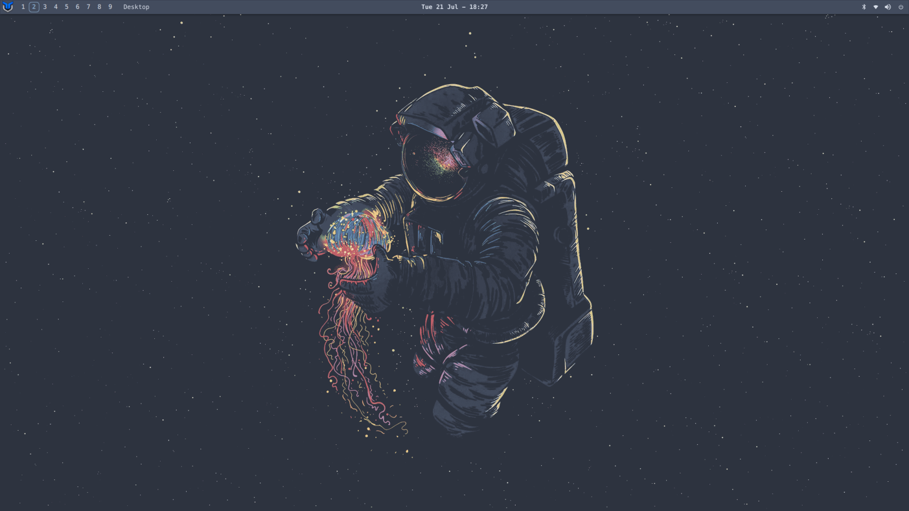

<div align="center">
  
  <p><strong>A fast, focused Fedora X11 desktop built for keyboard-driven work.</strong></p>
  <p>
    <a href="https://dwm.christitus.com">Documentation</a> |
    <a href="https://github.com/ChrisTitusTech/dwm-titus/releases/latest">Latest release</a> |
    <a href="./CHANGELOG.md">Changelog</a> |
    <a href="./CONTRIBUTING.md">Contributing</a>
  </p>
</div>



dwm-titus is a complete, lightweight X11 desktop with sensible defaults,
guided installation, and powerful customization. It is designed for people who
want a responsive keyboard-first workflow without having to assemble every
part themselves.

**dwm-titus is a Fedora-only distribution.** Fedora Linux is the sole supported
platform for installation, runtime behavior, package resolution, testing, and
release qualification. Use either the Fedora desktop image or the
existing-system installer on Fedora Linux.

## What You Get

| Experience | What it includes |
| --- | --- |
| **A focused desktop** | Automatic window tiling, nine workspaces, fast keyboard navigation, multi-monitor support, and flexible fullscreen modes. |
| **Everyday essentials** | A polished panel, application launcher, system tray, Control Center, Settings, notifications, screenshots, audio, brightness, and power controls. |
| **Easy discovery** | An interactive keybind viewer, guided display setup, built-in diagnostics, workstation self-heal, and clear unsupported-feature reporting. |
| **Personal configuration** | Live-reloading hotkeys, themes, and window rules, with local configuration preserved across upgrades. |
| **Two installation paths** | A ready-to-install Fedora image or an installer for an existing Fedora system. |

> dwm-titus is an X11 desktop. A Wayland-native session is not currently part
> of the project scope.

## Install

Choose the path that matches your system:

| Installation | Best for | What it does |
| --- | --- | --- |
| [Fedora ISO](#fedora-iso) | A fresh, dedicated installation | Installs the complete Fedora-only desktop from bootable media. |
| [Existing system](#existing-system) | A Fedora installation you already use | Installs dependencies, the desktop session, and the selected feature set while preserving local configuration. |

For complete requirements and installation details, see the
[Installation Guide](https://dwm.christitus.com/install.html).

### Fedora ISO

Download the **current offline images** for Fedora 44 x86_64:

| Image | Download |
| --- | --- |
| Standard | [Standard ISO](https://downloads.christitus.com/iso/dwm-titus.iso) |
| NVIDIA | [NVIDIA ISO](https://downloads.christitus.com/iso/dwm-titus-nvidia.iso) |
| Verification | [SHA256SUMS](https://downloads.christitus.com/iso/SHA256SUMS) and [release notes](https://github.com/ChrisTitusTech/dwm-titus/releases/latest) |

These stable URLs always serve the current builds. The [build manifest](https://downloads.christitus.com/iso/BUILD-MANIFEST.json)
records the version, sizes and hashes. Download a fresh checksum file with your
selected ISO; restart partial downloads if the build changes. In that directory, run:

```sh
sha256sum --ignore-missing -c SHA256SUMS
```

Confirm your ISO reports `OK`. Write it as a disk image to an 8 GB or larger USB
drive, boot it, choose your disk, locale and administrator account in Anaconda,
then install and reboot into the `dwm` session. Writing the USB erases its contents;
review Anaconda's disk changes before starting installation.

Packages are already included in the compressed system image. Installation needs
no Internet connection or software selection. The images include Quickshell,
Gear Lever, `maim`, region capture and clipboard tools. Internet access is needed
later for updates and additional software.

Images built from 0.7.2 also include `fastfetch` and offer a visible initial
package update once repositories are reachable. The flow measures mirrors, asks
for authorization, and preserves DNF confirmation; Enter accepts and No cancels.
See [initial updates and DNF defaults](docs/INITIAL-UPDATE.md) for retry and
configuration overrides.

See the [installation guide](https://dwm.christitus.com/install.html#fedora-iso-recommended-for-a-new-installation)
and [current build qualification](https://downloads.christitus.com/iso/BUILD-NOTES.md)
for tested firmware modes and hardware limits, including NVIDIA and Secure Boot.
Use the Cloudflare links above for the current offline installation images.
For building images, see [compressed-image builds](docs/COMPRESSED-IMAGES.md).

### Existing System

```bash
git clone https://github.com/ChrisTitusTech/dwm-titus.git
cd dwm-titus

./install.sh --dry-run --non-interactive --profile recommended
./install.sh --profile recommended
```

The dry run shows the dependency and installation plan before anything changes.
The installer requires Fedora, preserves existing personal configuration, and
installs the managed desktop components. It accepts only Fedora's
`/etc/os-release` identity and rejects every other operating-system identity
before making changes.

| Profile | Includes |
| --- | --- |
| `core` | The X11 session, required dependencies, and one terminal emulator. |
| `recommended` | The complete everyday desktop, including Alacritty, Quickshell, Gear Lever for AppImages, theming, screenshots, audio, brightness, and the PackageKit, Python RPM binding, AccountsService, CUPS, and printer-tool prerequisites for Phase 6 system management. |
| `full` | The recommended desktop plus optional file-manager, keyring, wallpaper, display-manager, and supported Fedora gaming integrations. |

`maim` is an optional dependency used only by the screenshot hotkeys. If it is
unavailable, installation continues and reports that the screenshot hotkeys
remain disabled; invoking one makes `dwm-screenshot` exit with
`dwm-screenshot: maim is not installed`. `xclip` and `xdotool` remain required
runtime dependencies for the X11 desktop and its other managed helpers.

## Dependencies

See [Desktop Dependencies](https://dwm.christitus.com/dependencies.html) for the
packages behind each desktop component, installation-profile differences, and
build, gaming, and image-specific dependencies.

## First Login

**Super** is the Windows key on most keyboards.

| Action | Keybind |
| --- | --- |
| Open the application launcher | <kbd>Super</kbd> + <kbd>R</kbd> |
| Open Alacritty terminal | <kbd>Super</kbd> + <kbd>X</kbd> |
| Open Control Center | <kbd>Super</kbd> + <kbd>F1</kbd> |
| Show the interactive keybind viewer | <kbd>Super</kbd> + <kbd>/</kbd> |
| Close the focused window | <kbd>Super</kbd> + <kbd>Q</kbd> |
| Switch workspace | <kbd>Super</kbd> + <kbd>1-9</kbd> |
| Open the power menu | <kbd>Super</kbd> + <kbd>Ctrl</kbd> + <kbd>Q</kbd> |

With a display manager, select the `dwm` session when logging in. From a TTY,
start the session with:

```bash
startx
```

## Customize Your Desktop

Most personal settings live under:

```text
${XDG_CONFIG_HOME:-$HOME/.config}/dwm-titus/
```

Hotkeys, themes, and window rules reload when their TOML files are saved.
Advanced compile-time preferences live in the user-owned `config.h`, which the
installer and future upgrades preserve.

The installer also provides `dwm-settings-display` and its root-owned
`libexec/dwm-titus/dwm-settings-display-root` persistence helper. Live display
discovery and previews require `xrandr`; hotplug watching requires `udevadm`;
only persistent Xorg install and rollback require `pkexec`. Named profiles live
under the `display-profiles/` directory in the XDG path above.
Run `dwm-display-setup detect`, then `dwm-display-setup`, for a guided wizard
that detects outputs and configures modes, positions, rotation, and the primary
display with a reversible preview. Persistent generation selects compatible
TearFree or NVIDIA Full Composition Pipeline behavior automatically; pass
`--force-full-composition-pipeline off` to disable the NVIDIA default.
The adjacent `dwm-settings-input` provider uses `xinput`, `setxkbmap` for
keyboard settings, `xkbset` for session-wide AccessX controls, and `udevadm`
for stable device identity and hotplug events. Kept values are stored in
`input-settings.conf` in the same XDG directory; `DWM_INPUT_SETTINGS_FILE` can
select another file.

The compositor settings in **Settings -> Appearance -> Compositor** and the CLI
helper `dwm-settings-picom` manage window opacity and rendering backends. Sliders
adjust active and inactive window opacity with live persistence in the active configuration
(resolved from `DWM_PICOM_CONFIG`, a running Picom `--config` argument, or standard
fallback paths `~/.config/picom.conf` and `~/.config/picom/picom.conf`). The automatic
backend policy selects GLX for accelerated Intel/AMD graphics and falls back to XRender
on NVIDIA or software rendering, with manual GLX, XRender, and EGL overrides available.
Edits preserve custom comments and includes with up to ten automatic recovery backups.
All 15 shipped presets include offline `Dwm-<preset>` application themes,
including `Dwm-dracula`, for Thunar and other native GTK 2/3/4 applications.
The system install places their files under `${DATADIR}/themes` (normally
`/usr/share/themes` with the supported installer); source updates install and
verify them too.
Qt applications using qt5ct or qt6ct receive the matching installed palette,
also listed in those tools from `${DATADIR}/qt5ct/colors` and
`${DATADIR}/qt6ct/colors`;
Alacritty and Kitty continue to receive the active terminal colors. Restart
Qt applications if they do not reload their platform theme dynamically.
These are dwm-titus palette adaptations of GTK's built-in widgets, not the
upstream third-party theme packages. Libadwaita and sandboxed applications may
follow only the light/dark preference rather than the custom palette.

Existing explicit `gtk_theme` values and Appearance personalization overrides
are preserved. Remove an explicit GTK theme setting to follow the bundled
preset automatically, or select a `Dwm-` theme in Appearance. The existing explicit `Nordic` selection remains supported; `Dwm-nord` is
also available offline. Existing installations need the supported source
installer once (`./install.sh --profile recommended`) to add the new system
file paths before subsequent updates can use Settings.
Maintainers regenerate assets with `python3 scripts/generate-app-themes.py`
after changing the shipped palettes.

Cursor theme changes in Settings take effect immediately across running X11
applications via `dwm-cursor-reload`.

See the [Configuration Guide](https://dwm.christitus.com/configuration.html)
and [Theming Guide](https://dwm.christitus.com/theming.html) for examples and
safe customization paths.

## Documentation

- [Installation](https://dwm.christitus.com/install.html)
- [Getting Started](https://dwm.christitus.com/getting-started.html)
- [Keybindings](https://dwm.christitus.com/keybinds.html)
- [Configuration](https://dwm.christitus.com/configuration.html)
- [Theming](https://dwm.christitus.com/theming.html)
- [Control Center](https://dwm.christitus.com/control-center.html)
- [Settings](https://dwm.christitus.com/settings.html)
- [How dwm-titus Works](https://dwm.christitus.com/patches.html)
- [Troubleshooting](https://dwm.christitus.com/troubleshooting.html)

The technical guide explains the project architecture, what dwm is, and how
the maintained enhancements fit together. You do not need to understand or
apply dwm patches to install and use the desktop.

## Troubleshooting

**Settings -> System** separates read-only **Reload status** from confirmed
metadata refresh and package installation. Review all package changes, including
dependency additions and removals, before confirming. PackageKit owns
authorization and cancellation; closing Settings does not cancel an operation.
If discovery or recovery is incomplete, reload status and follow its guidance.

The same section provides confirmed account, password, printer, and software-source
tool launches. Missing tools or stale provider status disable only the affected
entry. Account and repository inventories remain read-only. A successful launch
does not mean administration inside the tool completed; authorize and confirm
those changes in the tool itself. Enter passwords only in the terminal prompt.

For timezone or system locale, **Load choices**, filter and select a reported
value, then **Review change**. Network time offers fixed enable/disable previews.
Review the complete preview before **Apply change**: a sent regional change
cannot be canceled. Cancel only dismisses the preview, and closing Settings does
not undo an action. An uncertain result requires fresh status and new confirmation,
not automatic retry. Locale changes apply to new sessions; log out manually when
ready. Synchronization status is labeled as the last read.
The panel and System Settings share one minute-level local clock. A newly
reported timezone refreshes both displays without restarting Quickshell.

Start with the built-in diagnostic report:

```bash
dwm-diagnostics
```

You can also run **Control Center -> Quick Actions -> Self-Heal** to execute a
configured workstation repair script (`dwm-self-heal` on `$PATH` or referenced in
`${XDG_CONFIG_HOME:-$HOME/.config}/dwm-titus/self-heal.path`) inside an interactive
terminal with visible output and authorization prompts.

You can also open **Control Center -> System Health** for a graphical overview.
If the session does not start, run `startx` from a TTY to see its error output.
The [Troubleshooting Guide](https://dwm.christitus.com/troubleshooting.html)
covers common session, panel, terminal, theme, display, and NVIDIA issues.

If the problem remains, [open an issue](https://github.com/ChrisTitusTech/dwm-titus/issues)
and include the relevant diagnostic output. Review it first and remove any
private system information.

## Contributing

Contributions are welcome. Read [CONTRIBUTING.md](CONTRIBUTING.md) for the
development workflow and validation requirements, and report security issues
using [SECURITY.md](SECURITY.md).

The main repository check uses a managed workspace under `$HOME/tmp` and
removes it when the run finishes:

```bash
scripts/run-tests
```

Project requirements and active work are tracked in [SPEC.md](SPEC.md),
[ROADMAP.md](ROADMAP.md), and [TASKS.md](TASKS.md).
