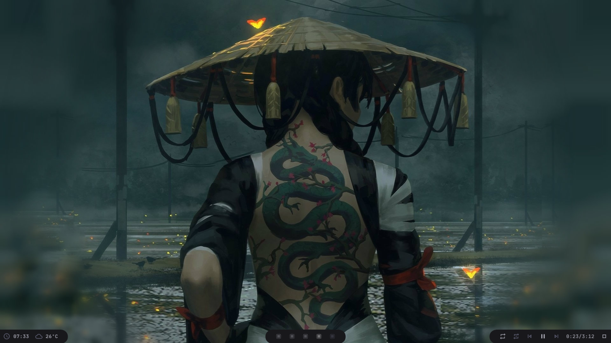
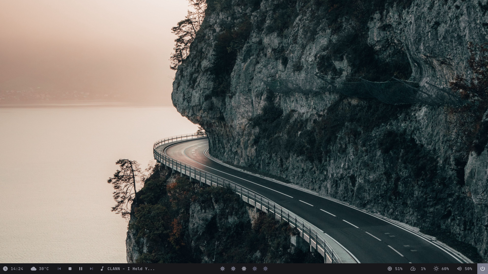
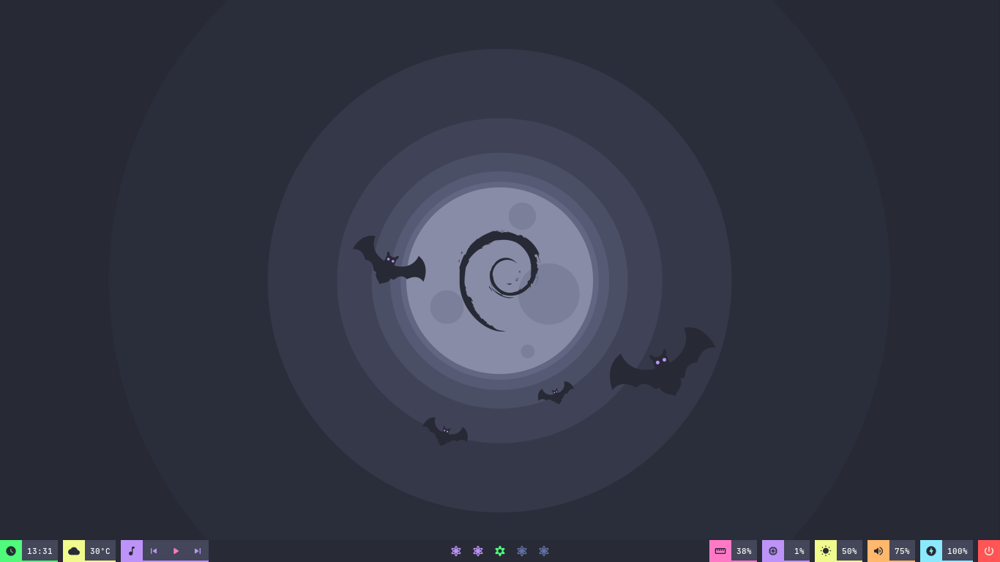
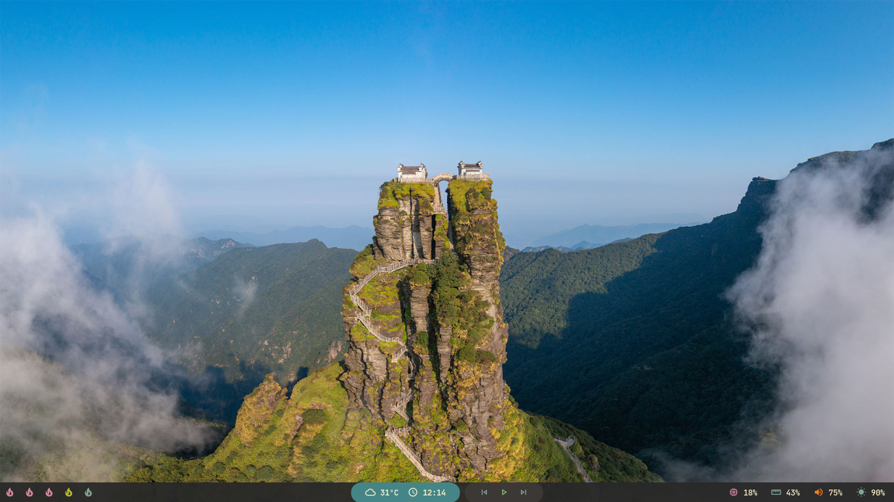
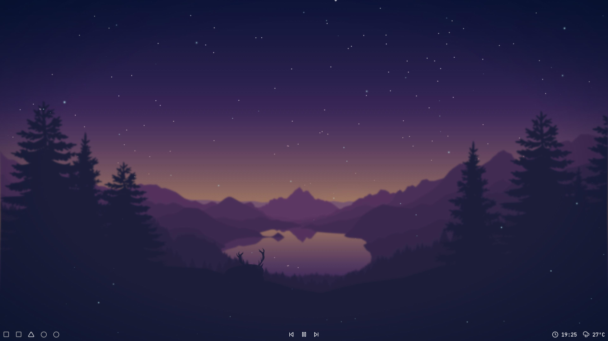
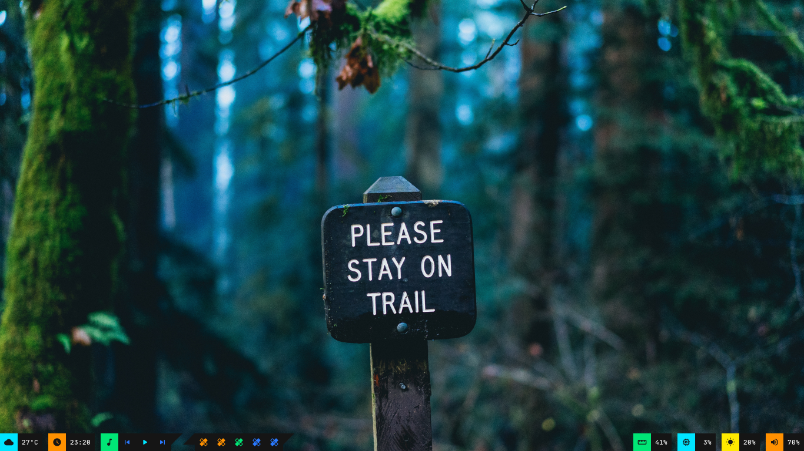
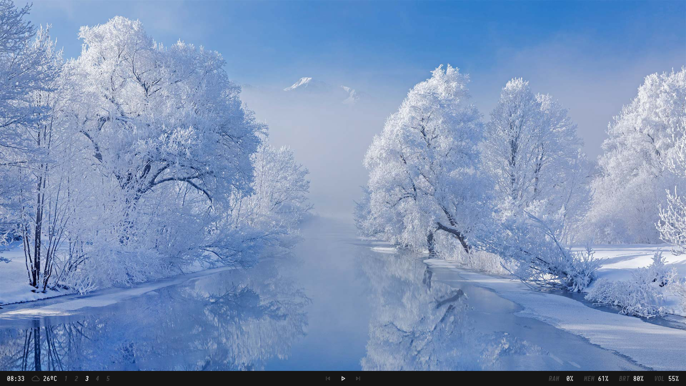
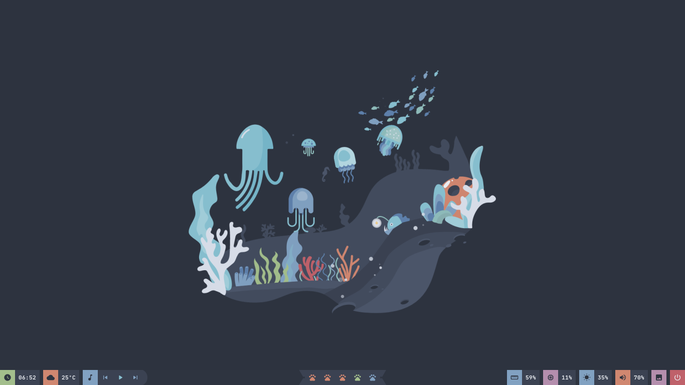
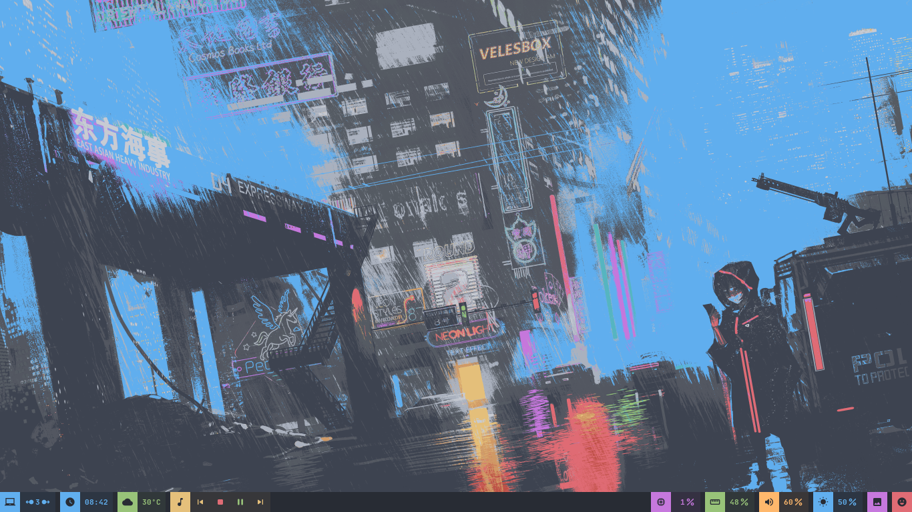

# Polybar Configuration (dwm-titus)

This directory contains the Polybar status bar configuration bundled with dwm-titus. It is **self-contained** — you do not need to clone any external repos.

## How It Works

When dwm starts, it launches `polybar/launch.sh` which:
- Detects connected monitors via `xrandr`
- Launches the **main** bar (with systray + EWMH tags) on the primary monitor
- Launches **secondary** bars (no tray) on additional monitors
- Auto-detects laptops (battery present) and uses `laptop-config.ini`

The default theme is **minimal** (Nord-inspired).

## Setup

### 1. Install Polybar
```bash
sudo pacman -S polybar
```

### 2. Install Fonts

The icon fonts (MaterialIcons, Feather) are bundled in `fonts/`:
```bash
mkdir -p ~/.local/share/fonts
cp -r fonts/* ~/.local/share/fonts/
fc-cache -fv
```

Also install the text font:
```bash
sudo pacman -S ttf-meslo-nerd
```

> The default text font can be changed in `fonts.ini`.

### 3. Config Location

When you run `sudo make install` from the dwm-titus root, Polybar configs are copied to:
```
~/.config/polybar/
```

The launch script path used by dwm is:
```
~/.config/polybar/launch.sh
```

### 4. Customizing Modules

Edit `themes/minimal/config.ini` to control which modules appear:
```ini
modules-left = dwm-tags
modules-center = title
modules-right = pulseaudio date tray
```

Available modules are in `themes/minimal/modules/`.

## Multi-Monitor

- **Single monitor**: One bar with systray + EWMH tags
- **Multiple monitors**: Primary monitor gets systray + EWMH; secondary monitors get a simpler bar
- Primary monitor is auto-detected via `xrandr --query`

## Weather Module

If using the weather module, get a free API key from [OpenWeather](https://openweathermap.org/api) and set:
```bash
export OPENWEATHER_API_KEY="your-key-here"
```

---

## Theme Gallery

The collection includes several themes. Screenshots are in `screenshots/`.

### Minimal (default)



```ini
modules-left = date weather round-right
modules-center = round-left bspwm round-right
modules-right = round-left mpd
```

### Chnvok



```ini
modules-left = date weather mpd
modules-center = bspwm
modules-right = memory cpu brightnessctl pulseaudio session
```

### Dracula



```ini
modules-left = date margin weather margin mpd
modules-center = bspwm
modules-right = memory margin cpu margin brightnessctl margin pulseaudio margin battery margin session
```

### Gruvbox



```ini
modules-left = bspwm
modules-center = round-left-blue weather date round-right-blue margin round-left mpd round-right
modules-right = cpu memory pulseaudio brightnessctl
```

### Lofi



```ini
modules-left = bspwm
modules-center = mpd
modules-right = date weather
```

### Material



```ini
modules-left = weather margin date margin mpd tri-upper-right tri-lower-left bspwm tri-upper-right
modules-center = 
modules-right = memory margin cpu margin brightnessctl margin pulseaudio
```

### Minimal



```ini
modules-left = date weather bspwm
modules-center = mpd
modules-right = cpu memory brightnessctl pulseaudio
```

### Nord



```ini
modules-left = date margin weather margin mpd round-right
modules-center = trap-left bspwm trap-right
modules-right = memory margin cpu margin brightnessctl margin pulseaudio margin wallz margin session
```

### One Dark



```ini
modules-left = bspwm margin date margin weather margin mpd
modules-center =
modules-right = cpu margin memory margin pulseaudio margin brightnessctl margin wallz margin session
```
