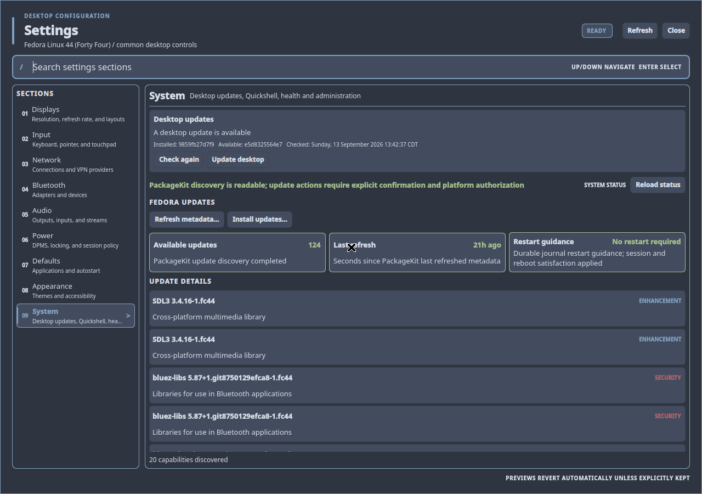
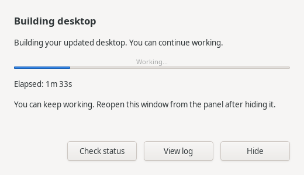

# Desktop updates

The first card in **Settings > System** checks the dwm-titus desktop against
official `main`. It covers the managed Quickshell configuration, dwm, installed
commands, managed data, and cursor assets. Fedora package updates below it
continue to manage the Quickshell application and other RPM packages.



Opening System checks once, with a five-minute cache. **Check again** bypasses
that cache. **Update desktop** previews the operation and missing required
packages; **Confirm update** starts it. System-file installation asks for
administrator authorization through polkit once for the whole update. The
installed helper retains that operation's approval through preparation,
installation, completion, and any immediate cleanup. It does not save your
password. A later update or explicit recovery starts with a new approval.
Settings closes when the administrator request starts so its always-on-top window cannot hide the
password dialog. The separate **Desktop update** window appears after the initial
authorization dialog finishes, so it cannot cover the password prompt. It remains open through shell
restarts, showing the current stage and elapsed time. **Hide** keeps the update
running; click the panel update indicator to reopen it. **View log** opens a bounded log viewer with Refresh log and Close buttons. Closing the log leaves progress open. A
desktop notification announces completion or a failure requiring attention.
**Hide Settings to show
authorization** reveals the desktop again if needed. No installation happens
just by opening Settings.



The progress bar is indeterminate during downloading, building, authorization,
and installation because those stages do not provide a reliable percentage.
Verification shows the actual number of system files checked. Closing Settings
does not stop the update. Reopening it reads the saved operation, including
interrupted or completed work. Progress updates automatically as the saved operation changes. The Settings card shows
the update log location during active and failed operations. No background polling runs while
idle.

## Installation and compatibility

Existing desktops must run the existing
[source update procedure](src/content/install.md#source-updates-and-recovery)
once to install the updater and its root-owned authorization helper. Fresh
installs record managed file hashes automatically. The revision is recorded
when available from the build checkout; older or exported source trees may show
`unknown` until the first confirmed update. Installations without a `.git`
directory can still install and verify a fixed official revision.

The GUI preserves personal TOML files, application configuration, `.xinitrc`,
and compile-time `config.h`. It replaces the project-managed Quickshell tree and
the managed `config` and `scripts` data trees. If the data directory is also a
Git checkout, the updater prepares and validates a fast-forwarded copy before
replacing it. Unrelated files in that directory are retained. Development
branches, tracked or untracked changes, ignored files inside `config` or
`scripts`, linked worktrees, and divergent history are blocked
with instructions to use the source workflow.

The installed manifest fixes the authorized system-file destinations, file
types and modes, cursor link targets, and package capability list. An update
that changes that contract stops before installation and asks for the source
installer. This avoids turning Settings into a general-purpose root installer.
Every system file must match its existing root-trusted hash, including the dwm
session binary, commands, helpers, and shared assets. The button updates managed
user files and repairs system-file drift. New system-file contents require the
source installer; a user-built bundle cannot establish new trusted hashes.
Authorization carries the prepared archive's digest and
confirmed revision; the root-owned copy must match both before installation,
preventing archive substitution while the authorization prompt is open.
Missing system directories also require that installer
and are not offered as automatic file repairs. Compiler overrides (`CC`,
`CFLAGS`, `CPPFLAGS`, and `LDFLAGS`) supplied to the updater are carried into its
worker and passed to the build.
Unsafe installed file modes or modified user-owned system files require the
source installer; recovery never restores special or writable mode bits.
Missing known build/source-update packages can be installed after confirmation;
the package manager owns its transaction and package locks.

When the dwm executable changes, **Installed - log out to finish** means the
files are verified but the running session still uses the previous executable.
Log out and back in normally. The next check verifies the active binary and
Quickshell IPC before clearing restart guidance. The updater never logs you out.

## Records

- `${PREFIX}/share/dwm-titus/desktop-install.json`: root-owned revision,
  system-file hashes, destinations, and dependency allowlist.
- `${XDG_STATE_HOME:-$HOME/.local/state}/dwm-titus/desktop-update/installed.json`:
  user-managed tree hashes and source/build configuration provenance.
- `desktop-update/status.json` and `desktop-update/operations/<id>/`: operation
  status, preview, log, and recovery inventory under that same state directory.
- `/var/lib/dwm-titus/desktop-updates/<id>/`: private root-owned system backup
  and write-ahead installation journal.
- `.dwm-update-<id>-*` beside each managed user directory: retained recovery
  copies, restricted to mode `0700`. They can contain Git history and private
  local files. Original live-directory modes are recorded for restoration.

Backups are retained for explicit recovery. Do not remove them while an update
is active or interrupted. After verifying the new session, they may be removed
as part of deliberate backup maintenance; no automatic retention policy deletes
them.

Checks have one 60-second backend deadline. The update service executes the
root-owned installed worker directly. Settings first validates the updater, its
manifest, helper, and parent directories before executing its absolute path; a
user-writable command earlier in PATH cannot intercept the update controls.
The backend inherits only validated system command directories in PATH. Its service removes loader/interpreter
startup variables before execution, then gives the worker only explicitly
allowed session, build, and proxy settings with trusted system command paths.
Those values reach the worker through a private mode-0600 file that is removed
after reading; proxy credentials never appear in process arguments. Shell
activation does not forward proxy settings.
An unfinished system/user transaction
blocks other users from superseding its recovery record until the initiating
worker or recovery flow confirms completion through the installed helper.
If all file work finished before completion was interrupted, recovery finishes
that transaction without undoing the verified files. Completion can be retried
safely even if another user's later update has already started.

## Recovery

A failed download or build leaves the installation unchanged. Read the displayed
log, fix the reported cause, and use **Check again**. Canceled or denied polkit
authorization does not count as successful installation. An authorization or
privileged-operation timeout stops automatic password requests immediately.
When dispatch may have occurred, the updater retains an interrupted operation
for explicit recovery rather than assuming nothing changed. Recovery progress
is reported separately from the original preparation or build step.

An interrupted installation blocks further updates. Close Settings and use a
terminal, or switch to a TTY with Ctrl+Alt+F3 if the shell is unavailable. Use the
exact operation ID shown by the saved status:

```sh
dwm-desktop-update status
dwm-desktop-update recover OPERATION_ID
```

Recovery requests administrator authorization once to restore the system files and
restores the managed user directories from the recorded copies. It refuses to
replace a newer installation or user files changed after the interruption.
Save conflicting changes separately before recovery; do not reset or delete a
checkout to bypass that protection. Log out and back in after restoration, then
check again. Recovery does not undo RPM transactions or downgrade packages.

If the installed updater itself is unavailable, use the existing full
[source recovery procedure](src/content/install.md#source-updates-and-recovery).
Retain the failed operation's log and backups for diagnosis.

## Validation

Run the focused backend and X11 fixture through the managed workspace:

```sh
scripts/run-tests make check-desktop-update
scripts/run-tests make clean all check-install-manifest check-dev-sync-install
scripts/run-tests make check-quickshell-qml
scripts/run-tests
```

`tests/test-desktop-update-security.py` must run as root inside a disposable
Fedora container. It refuses to operate on a host. It tests real installed-helper
ownership, allowlists, bundle integrity, stale previews, installation, and
rollback. GUI fixture tests do not substitute for this privileged coverage or
for a clean Fedora build and staged installation.

`tests/test-desktop-update-integration.py` also requires a disposable Fedora
container. It builds two local source revisions, runs the real unprivileged
worker, authorizes only the test helper through a container-only polkit rule,
and verifies the resulting installation and preserved personal configuration.
It does not contact upstream or modify the host. A separate
`scripts/run-tests python3 tests/test-desktop-update-service.py` checks the real
user-service handoff on a host with an available user systemd manager.

A complete `make install` holds both the target user lock and system lock through
system and user installation. Direct `make install-user` also takes the user
lock. The installer and development synchronization use the complete guarded
installation. Source installation refuses to replace system files while a desktop update or
recovery transaction is unfinished. Live `make uninstall` uses the same system
transaction exclusion so recovery retains its installed helper and manifest.
Complete recovery as the user who started
the update before running the source installer. Managed data, Quickshell, and
recovery directories must be separate, including after resolving symlinks.
Incomplete or invalid user receipts never count as an up-to-date installation.
FIFOs, sockets, devices, and other unsupported managed-tree entries are rejected
before reserving an update and again before copying.

After confirmation, authorization reserves the update before downloads and builds
so a source installation or another user's update cannot supersede its preview.
A failed preparation releases the reservation; an interrupted preparation uses
the same recovery command without replacing system files. Dependency installation
also rejects every unfinished transaction before any package command runs.
Every operation status change first updates a separate durable status copy. If
the main status is lost, its operation identity and recovery state are restored
from that copy. Malformed status without transaction records can be rebuilt by
a forced check; retained transactions are never discarded by that reset. If
both status copies are damaged and multiple operations remain, restore the
current status from backup before recovery. Candidate manifests
accept only the fixed schema and stay within the installed receipt size limit.

Updater Git commands ignore system/global Git configuration and inherited Git
configuration variables, disable hooks, templates, filesystem monitors, and
credential helpers, and allow only local-file and HTTPS transports. Use the
forwarded proxy and certificate environment settings for network customization.

Desktop builds require Fedora's `bubblewrap` and `libseccomp` packages. The
source installer and source-sync dependency profile install them. Mutable
checkout, source scripts, staged Git merges, and builds run in private user,
process, mount, and network namespaces with no capabilities, host session bus,
or host home directory. A sealed seccomp filter denies socket creation, connections, and io_uring,
including Unix sockets placed inside the build tree. Only the
required source/staging directories are exposed; system tools are read-only.
The installed worker performs polkit requests outside this sandbox. If the host
disables user namespaces or sandbox setup fails, the update stops and requires
the source installer; there is no unsandboxed build fallback. Custom build
overrides remain literal, but tools/files outside the exposed system and source
paths are unavailable to automatic builds.


The elevated helper is kept only for the active transaction on private pipes.
Requests cannot change the authorized operation, installed generation, or
selected revision, and all existing root-owned manifest checks still apply.
The helper exits on completion or when the worker closes its pipe, with a
one-hour maximum lifetime. Slow builds do not cause repeated password prompts;
if the session ends or expires, the update stops for explicit recovery instead
of silently elevating again. Installing this helper change requires the source
update procedure once; the older installed worker cannot replace its own
root-trusted executable through the update button.

The progress window is a normal GTK window in its own unprivileged user service,
using the existing GTK portal and Python GObject dependencies. It never requests
administrator access or starts an installation. Its **Close** and **Hide** actions
only affect the window. New installed helpers require the documented source
update procedure once before the button can use them.
