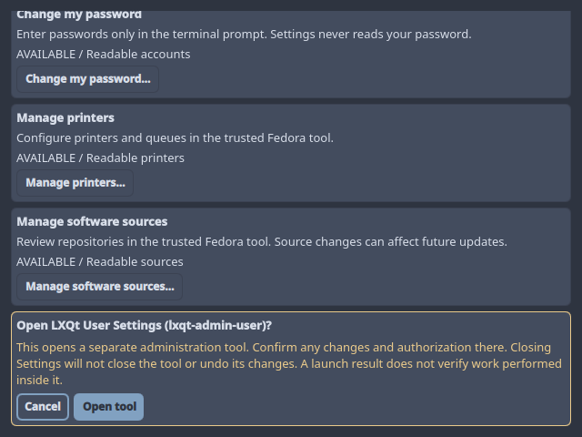
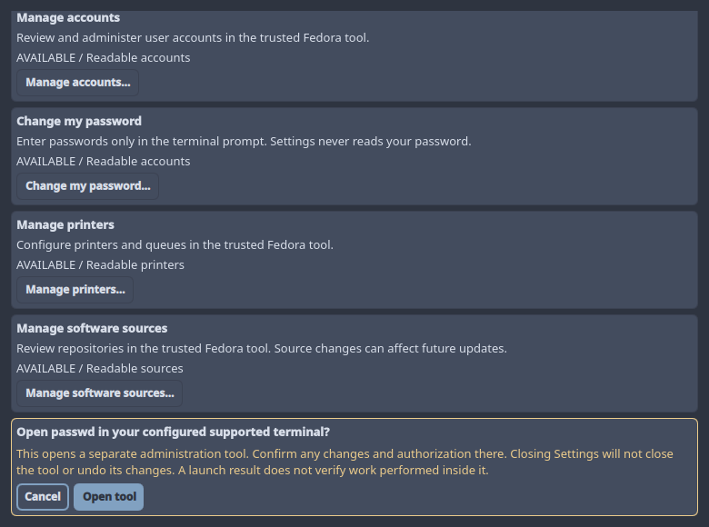
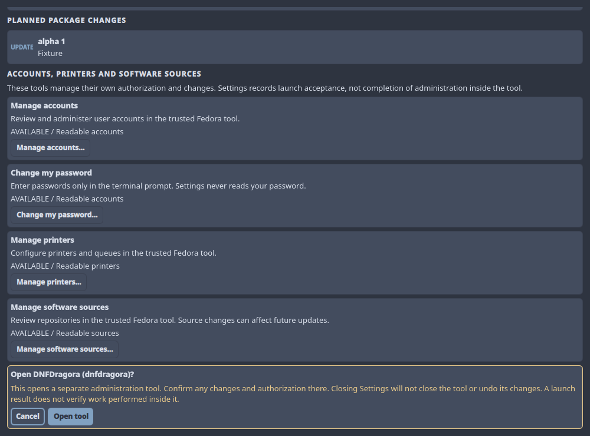

# Phase 6 Delegated Settings UI Evidence

This records the delegated-control boundary, not completion of Phase 6.

## Environment and scope

- Date: 2026-09-07.
- Fedora 44 x86_64; Qt 6.11.2 and the supported Fedora Quickshell 0.2.1 snapshot.
- Private Xvfb displays with copied managed QML and fixed fixture providers.
- No real administration tool, password prompt, authorization request, or host
  mutation. No installed configuration synchronization or shell activation.
- Real graphical authorization and installed-session acceptance remain pending.

## Automated fixture matrix

`scripts/run-tests tests/test-quickshell-system-management-xvfb.sh` includes
48 UI scenarios: all four tools at 640x480, 780x580, and 1000x740 with success,
permission denial, unsupported results, and maximum inventories. Assertions cover
readable state after unavailable actions and terminal results, passive Cancel,
focus restoration, whole-card reveal, fixed dispatch counters, root operation
survival after closure, and absence of update cancellation on native operations.
Maximum lists retain 256 accounts and 512 sources in virtualized 180-pixel views.
The existing 16 internal confirmation scenarios remain independent coverage.

## Actual keyboard and visual checks

Three private windows were exercised with X11 keyboard events. Enter on Cancel
launched nothing and restored focus to the originating button. Enter reopened
the confirmation; Tab selected Open tool. Shrinking the window height by 80
pixels kept the confirmation visible. Restoring size and pressing Enter produced
exactly one accepted fixture launch and one acknowledgment. The checks passed for
accounts at 640x480, password at 780x580, and sources at 1000x740. No real tool was
opened. Managed test workspaces and process groups were cleaned afterward.

Initial testing exposed focus reveal before outer layout/content-height
publication. The correction follows geometry notifications, not a timer. The
assertions require the entire confirmation and restored originating card to fit
within the viewport. Screenshots below use private fixture data only.

