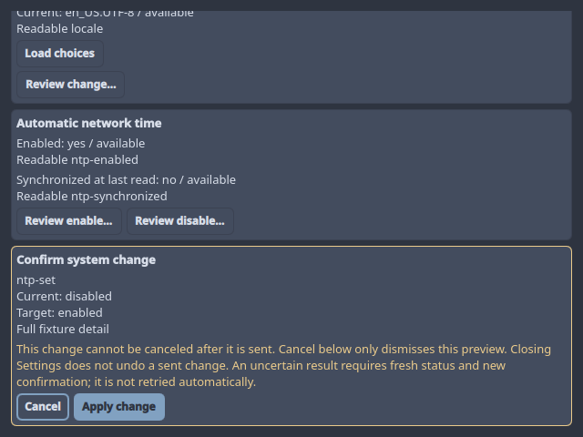
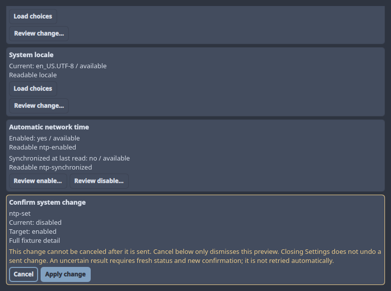
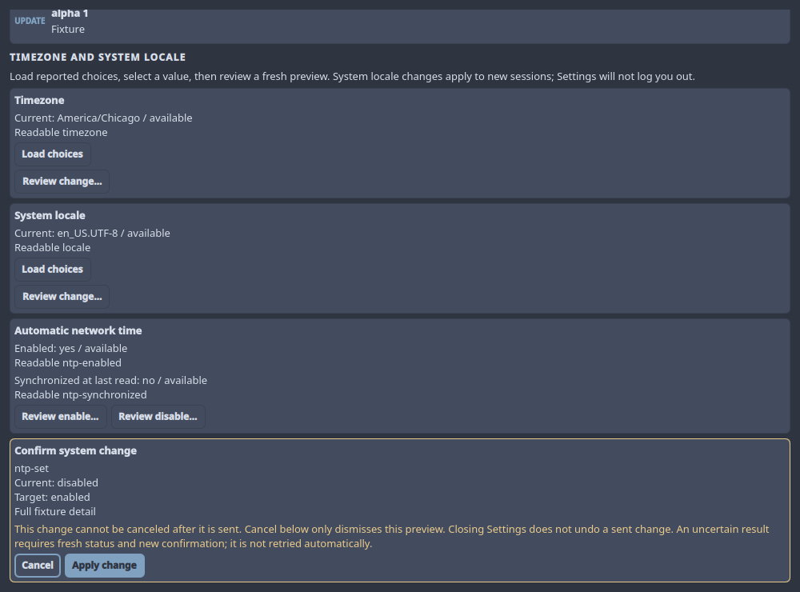
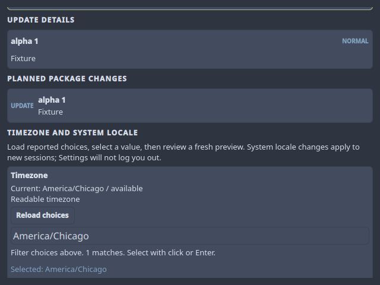
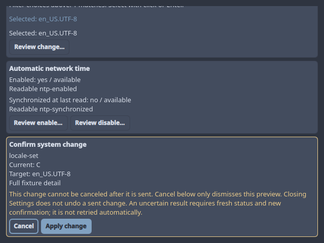
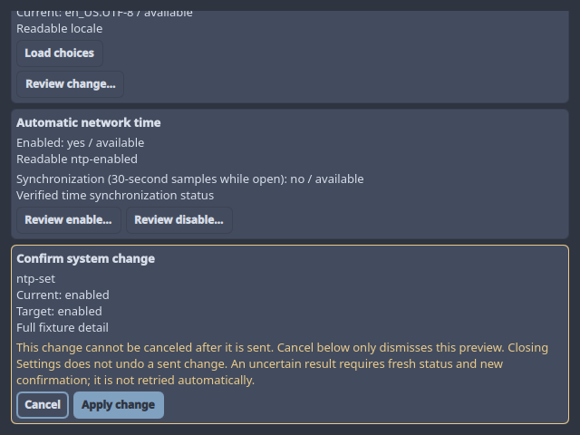
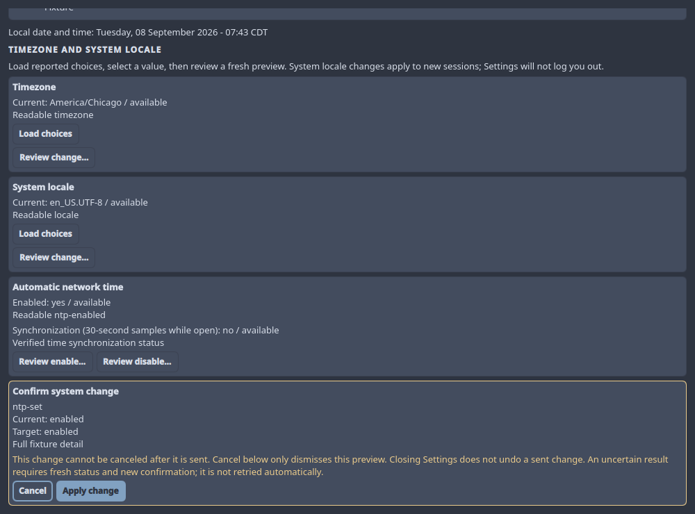

# Phase 6 Regional Settings UI Evidence

This qualifies the regional-control boundary, not completion of Phase 6.

## Environment and scope

- Date: 2026-09-07.
- Fedora 44 x86_64, Qt 6.11.2, supported Fedora Quickshell 0.2.1 snapshot.
- Private Xvfb displays and copied managed QML with fixed fixture providers.
- No host timezone, locale, NTP, authorization, or installed configuration change.
- At this initial boundary, clock refresh, visible NTP sampling, graphical
  polkit, and combined installed qualification were pending. Clock evidence is
  recorded in `P6-CLOCK-EVIDENCE.md`; sampling evidence follows below.

## Automated fixture matrix

`scripts/run-tests tests/test-quickshell-system-management-xvfb.sh` includes 66
regional UI cases: three actions at 640x480, 780x580, and 1000x740, each with
success, denial, unsupported results, uncertain output/replay, maximum catalogs,
denied reads, and malformed reads, plus NTP disable at all three sizes. The
catalogs contain up to 2048 timezones or
4096 locales, with virtualized 144-pixel views. Assertions cover exact filtering
and selection, disabled unavailable actions, full plaintext previews, cancellation
warnings, passive Cancel, focus restoration, confirmation geometry, fixed dispatch
and acknowledgment, and root ownership after closure. Read failures launch no
action. The 42 coordinator cases remain separate lifecycle/race coverage.

## Actual keyboard and visual checks

NTP confirmation was exercised with real X11 keys at all three sizes. Enter on
Cancel launched nothing and returned focus to the NTP origin. Enter reopened the
preview; Tab selected Apply change. Shrinking the window height by 80 pixels
preserved the confirmation. Restoring size and pressing Enter produced exactly
one fixed fixture action and acknowledgment. No service mutation was made.

Timezone and locale were separately exercised at 640x480: typing the exact query,
Tab to the list, Enter to select, Tab to Review change, Enter to open the preview,
and Enter on Cancel. Screenshots verified full targets and warnings. No action
or acknowledgment was dispatched. Test workspaces and process groups were cleaned.
The asynchronous preview tests allow Qt Quick's layout pass before checking
geometry; production reveal follows geometry notifications without polling.
A disable-specific regression reproduced incorrect return focus to Enable.
The corrected UI retains the exact preview argument and restores Disable.
Post-gate review identified an off-screen read-error explanation. Errors now
receive focus and follow geometry-driven reveal when the user has not moved
elsewhere. Read UI cases require complete plaintext explanations without a
mutation; moved-focus cases preserve the user's current interaction.
Oversized previews keep the focused Cancel or Apply button visible instead of
alternating between the card's clipped top and bottom. The success/outcome cases
shrink to a 120-pixel content viewport, repeatedly reveal each focused button,
and restore the original size before dispatch. Large locale cases retain full
512-byte current-value and override-detail fields; the preview remains scrollable.
Catalogs are additionally capped to the actual content viewport. Maximum-list
cases verify first/last/current rows at 120 pixels with repeated focus reveal.
Hosted review added explicit asynchronous-message focus coverage for search,
catalog, load/review, NTP, and confirmation controls. Messages preserve an active
control; a failed read can still reveal its explanation when focus remains on
its initiating control. Catalog availability assertions now begin with an exact
selected value, so selection requirements cannot mask an unavailable action.
Regional read buttons establish focus on activation, including mouse clicks;
tests invoke the same activation path without supplying focus themselves.
Window-wide focus checks also preserve Reload status, the outer scrolling pane,
and a fixture control outside the pane. Malformed-read cases move focus during
the real pending read. Apply retains its origin until the operation releases the
workflow; successful open-pane cases restore the exact enabled origin, including
NTP Disable. Closing Settings or moving focus elsewhere retires that restoration.

## Visible NTP sampling, 2026-09-08

The same Fedora/Qt/Quickshell environment passed the clean build and full managed
suite. It now includes 84 regional UI cases: the original 66 plus nine owner-
reconciliation and nine routine-sampling cases. Sampling preserves the verified
prompt, restores Apply focus when appropriate, and does not steal focus moved
outside the controls. All three actions also reject reentrant confirmation while
the raw sample claim is held. This caught a QML dependency-order defect: checking
the raw claim before notifying ownership could leave controls disabled after a
read. The notifying ownership is now read first, and the full X11 matrix passes.

Ten sampling cases cover success, read denial, capability loss, owner arrival,
closure during a read/claim/publication, required snapshot recovery, a verified
fixture NTP result, and the actual 30-second timer. Reads do not overlap, and only
the explicit fixture-action case sends a mutation. The 57 finite-reader, ten
time-reconciliation, 42 regional-coordinator, and 48 delegated-UI cases also pass.
Closed Settings measured 0.067% CPU; closed large surfaces measured 0.00%.

Two actual read-only Fedora `ntp-sample` calls, 31 seconds apart, returned complete
validated two-property observations. The passive `watch-time` reader reported
two authenticated owner arrivals and no property-change events, then exited
cleanly on TERM. This tests idle daemon reactivation, not graphical authorization
or a real NTP mutation. The application timer and action trigger were exercised
with private providers; combined installed qualification remains pending.

Window-only captures at 640x480 and 1000x740 were visually checked for the sampling
label, full warning, and visible Cancel/Apply controls. The smaller viewport
scrolls earlier content while keeping the confirmation visible. These use copied
QML and fixed private providers; no installed shell or host setting was changed.

