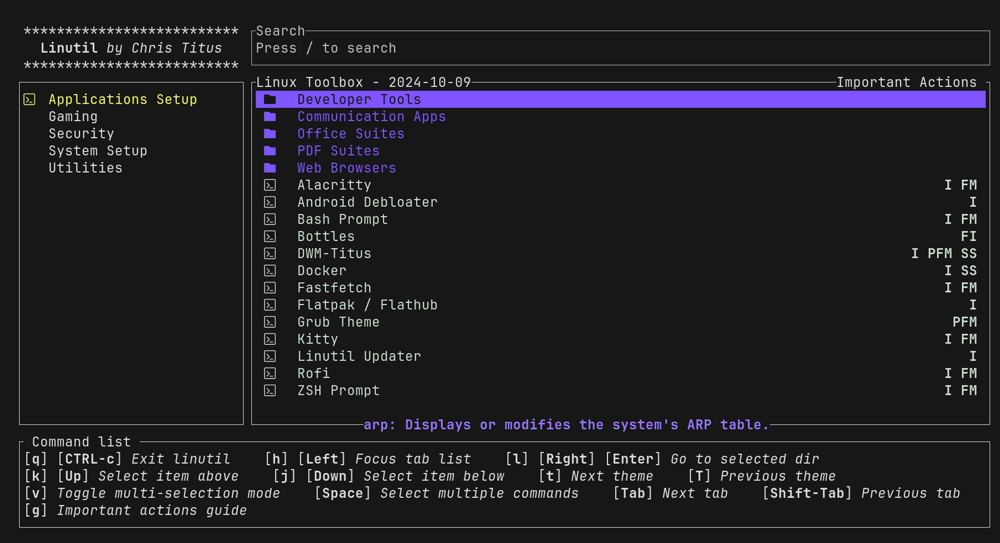

# Installation

> Arch Linux (or an Arch-based distro) with Xorg is required.

## Quick Install (Recommended)

The easiest way is via [Linutil](https://christitus.com/linux):

```bash
curl -fsSL https://christitus.com/linux | sh
```

In the TUI, press `v` to multi-select, then select **dwm**, **rofi**, **bash prompt**, and **ghostty**. Press `Enter` to install.



## Manual Install

### 1. Dependencies

**Build:**
```bash
sudo pacman -S --needed base-devel libx11 libxft libxinerama imlib2 libxcb xcb-util freetype2 fontconfig
```

**Xorg:**
```bash
sudo pacman -S --needed xorg-server xorg-xinit xorg-xrandr xorg-xsetroot xorg-xset
```

**Runtime:**
```bash
sudo pacman -S --needed rofi picom dunst feh flameshot dex mate-polkit alsa-utils noto-fonts-emoji ttf-meslo-nerd
```

**Terminal** (pick one — ghostty is the default):
```bash
sudo pacman -S ghostty   # or: alacritty, kitty
```

**Status bar:**
```bash
sudo pacman -S polybar
```

### 2. Clone and Build

```bash
git clone https://github.com/ChrisTitusTech/dwm-titus.git
cd dwm-titus
cp config.def.h config.h
make
sudo make install
```

### 3. Fonts

Polybar icon fonts are bundled in `config/polybar/fonts/`:
```bash
mkdir -p ~/.local/share/fonts
cp -r config/polybar/fonts/* ~/.local/share/fonts/
fc-cache -fv
```

### Automated Installer

```bash
./install.sh
```

The script handles all dependency installation, font copying, and config placement.

## Starting dwm

**Display manager** (SDDM, GDM, LightDM): log out and select **dwm** from the session list.

**startx:**
```bash
startx
```

The provided `.xinitrc` disables screen blanking, starts dbus, launches Polybar, and runs dwm.

