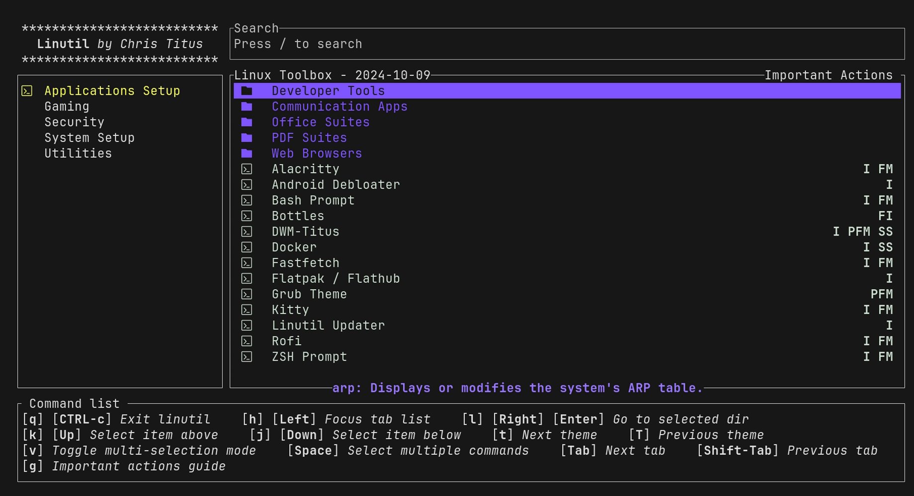

# Installation

> A supported Debian-, Arch-, or Fedora/RHEL-family distribution with Xorg is
> required.

## Quick Install (Recommended)

The easiest way is via [Linutil](https://christitus.com/linux):

```bash
curl -fsSL https://christitus.com/linux | sh
```

In the TUI, press `v` to multi-select, then select **dwm**, **bash prompt**,
and **alacritty**. Press `Enter` to install.

Current dwm-titus installs provide the checksum-verified Herdr helper. Run it
after the Linutil path:

```bash
install-herdr
```



## Manual Install

### 1. Dependencies

The supported dependency path is the installer because it resolves package
names for Debian-, Arch-, and Fedora/RHEL-family systems from the shared map:

```bash
./install.sh --dry-run --non-interactive --profile core
./install.sh --profile full
```

Use `core` for the required build/X11/session packages and one terminal
emulator, `recommended` for the desktop layer plus Herdr on top of Alacritty,
or `full` for optional extras such as file-manager integration, portals,
keyring login integration, wallpapers, and display-manager setup. On x86_64
Fedora, `full` can also install Steam, Gamescope, GameMode, and MangoHud after
repository approval.
The installer separately asks before enabling the `christitustech/copr-fedora`
COPR for patched Gamescope and RPM Fusion nonfree for Steam. Declining skips the
gaming subset without affecting other full-profile extras.

### 2. Clone and Build

```bash
git clone https://github.com/ChrisTitusTech/dwm-titus.git
cd dwm-titus
cp config.def.h config.h
./scripts/dev-sync-install.sh
```

For later source-checkout updates, run the same command so the binary,
installed helpers, managed Quickshell configuration, and data copy stay at one
revision. Run `./scripts/dev-sync-install.sh --check` after any requested
session restart to verify the active runtime.

### Automated Installer

```bash
./install.sh
```

The script detects the distribution family and handles dependency
installation, font copying, display-manager integration, and config placement.
Existing user configuration and `.xinitrc` files are preserved. Upgrades remove
the known legacy `dwm-graphical-session.service` and
`wm-graphical-session.service` early-start configuration so XDG applications
start only after the X11 display environment is available; customized user
units are disabled from early startup but otherwise preserved.

Recommended and full profiles install Herdr as the default interactive
workspace inside Alacritty. The repository downloads the official
`https://herdr.dev/install.sh` into an isolated staging directory and verifies
repository-pinned SHA-256 checksums for both that installer and its resulting
Herdr binary before copying it into `~/.local/bin`. A checksum mismatch or
network failure leaves Alacritty usable and reports that Herdr was skipped.
When the `codex` or `claude` command is already available, the helper also runs
Herdr's matching `integration install` command so native Codex and Claude Code
sessions can be restored. Integration failures are reported separately from
binary installation failures.

When matching vendor XDG entries exist for Picom, the polkit agent, or Light
Locker, the installer copies each entry to the user autostart directory and
adds only the dwm session exclusion. Original commands and vendor session
guards remain intact, no entry is created when the vendor entry is absent, and
existing user entries are preserved.

Installer package profiles are selected with `DWM_INSTALL_PROFILE`:

- `core`: required build packages, X11/session runtime, and one supported
  terminal emulator. Herdr is skipped unless `--install-herdr` is provided.
- `recommended`: `core` plus the recommended desktop layer such as Quickshell,
  Herdr on top of Alacritty, Picom, Feh, Dex, fonts, theming, screenshot,
  audio, Bluetooth control and tray tools, and brightness tools. It also
  installs portable GTK theme packages where available and installs Nordic
  system-wide for the default Nord theme.
- `full`: `recommended` plus optional extras such as Thunar with SMB-share
  browsing, network tray utilities, portals, keyring login integration,
  wallpapers, and display-manager setup. x86_64 Fedora full installs also
  include Steam, Gamescope, and 64-bit and 32-bit GameMode and MangoHud support
  after separate repository approval.
  The installer enables the `christitustech/copr-fedora` COPR for Gamescope and
  RPM Fusion nonfree for Steam, then adds the invoking user to the `gamemode`
  group; log out and back in before using its privileged tuning helpers.

The default is `full` to preserve the historical automated installer behavior.
For a minimal install:

```bash
DWM_INSTALL_PROFILE=core ./install.sh
```

The same profile can be selected with a flag:

```bash
./install.sh --profile core
```

Interactive runs print the resolved package plan before prompting. For CI,
packaging checks, or scripted validation, use the non-interactive flags:

```bash
./install.sh --dry-run --non-interactive --profile core
./install.sh --non-interactive --yes --profile recommended
./install.sh --non-interactive --yes --profile full --enable-fedora-gaming-repos
```

Without `--enable-fedora-gaming-repos`, unattended Fedora full installs skip
Steam, Gamescope, GameMode, and MangoHud rather than changing repository trust.

Use `--skip-herdr` or `DWM_INSTALL_HERDR=false` to skip Herdr installation.
These installation controls do not disable a Herdr executable that is already
available; set `DWM_HERDR=0` in the session environment to bypass an existing
Herdr installation at runtime. Use `--install-herdr` or
`DWM_INSTALL_HERDR=true` to include Herdr with the core profile. Automatic
recommended/full-profile installation is limited to x86_64 and aarch64 because
those are the Linux architectures published by Herdr. Herdr can also be
installed or repaired separately:

```bash
install-herdr
install-herdr --force
```

Upgrades preserve an existing `hotkeys.toml`. If an earlier installer seeded
its `terminal` variable to `alacritty`, `kitty`, or another direct terminal,
the installer prints the exact change needed to use `dwm-terminal` and Herdr
from Super+X without overwriting that user-owned file.

## Starting dwm

**Display manager** (SDDM, GDM, LightDM): log out and select **dwm** from the session list.

When the interactive installer runs inside an active X11 session, it offers
the `dwm-display-setup` wizard after installation. The wizard previews the
chosen resolution and multi-monitor layout, then installs a backed-up Xorg
fragment. Installations run from a TTY or in non-interactive mode defer this
step; after the first X11 login, run:

```bash
dwm-display-setup
```

**startx:**
```bash
startx
```

The provided `.xinitrc` disables screen blanking, starts the configured Quickshell panel, and runs dwm.

## Minimal Session Profile

The minimal supported profile is useful for lean systems, recovery sessions,
and portability testing. It keeps only:

- an X11 server and either a display-manager session or `startx`
- D-Bus session support
- `dwm`
- one supported terminal available through `dwm-terminal`
- required X11 helpers used by core startup and display commands, such as
  `xrandr`, `xset`, and `xsetroot`

Quickshell, Picom, Feh, Dex, a polkit agent, screenshot tools, wallpapers, tray
utilities, and audio or brightness helpers are optional in this profile.
Missing optional components should appear as degraded features in
`dwm-diagnostics`, not as session-fatal failures.

For `startx`, a minimal `.xinitrc` can be:

```sh
#!/bin/sh
xset s off
xset -dpms
xsetroot -cursor_name left_ptr
exec dbus-run-session dwm
```

If the login path already creates a user D-Bus session, use `exec dwm`
instead of wrapping it with `dbus-run-session`.

After installation, verify the profile with:

```bash
dwm-diagnostics
dwm-terminal --print-command
```

`dwm-diagnostics` must report zero required failures before treating the
minimal profile as ready. Optional degraded features can remain unresolved.
When Herdr is installed, a plain `dwm-terminal` opens it in Alacritty. Commands
such as `dwm-terminal -e sh -c 'command'` bypass Herdr and run directly in the
outer emulator.
