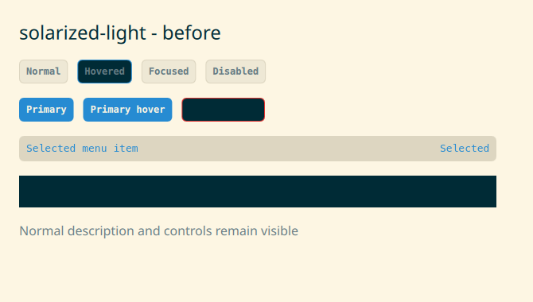
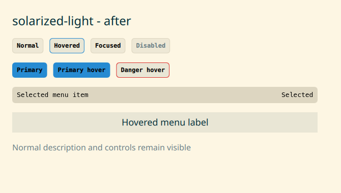
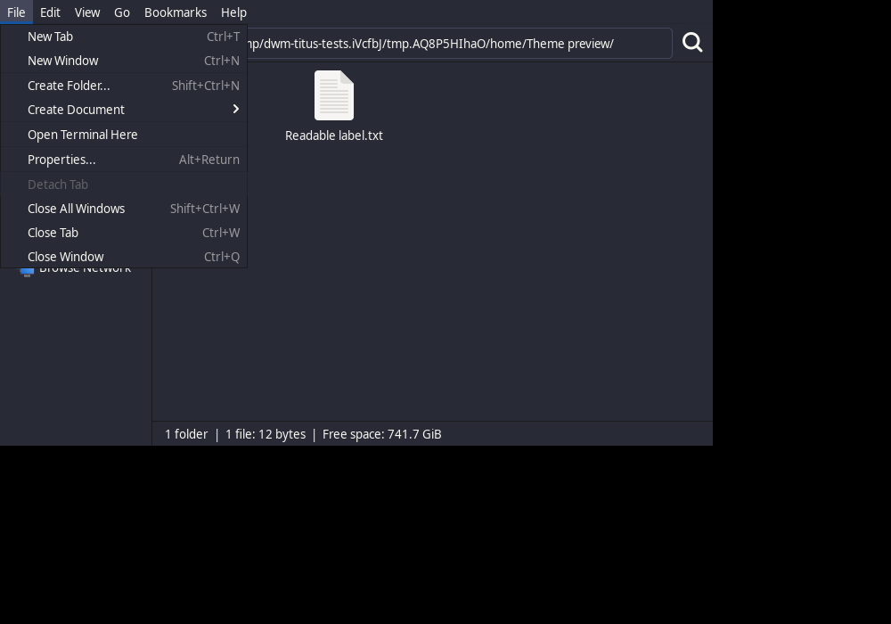
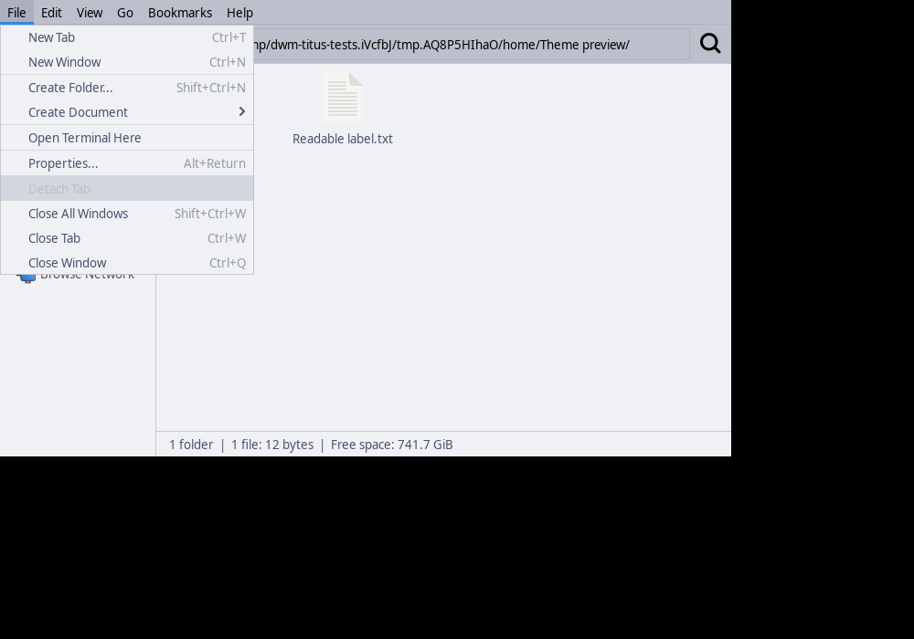
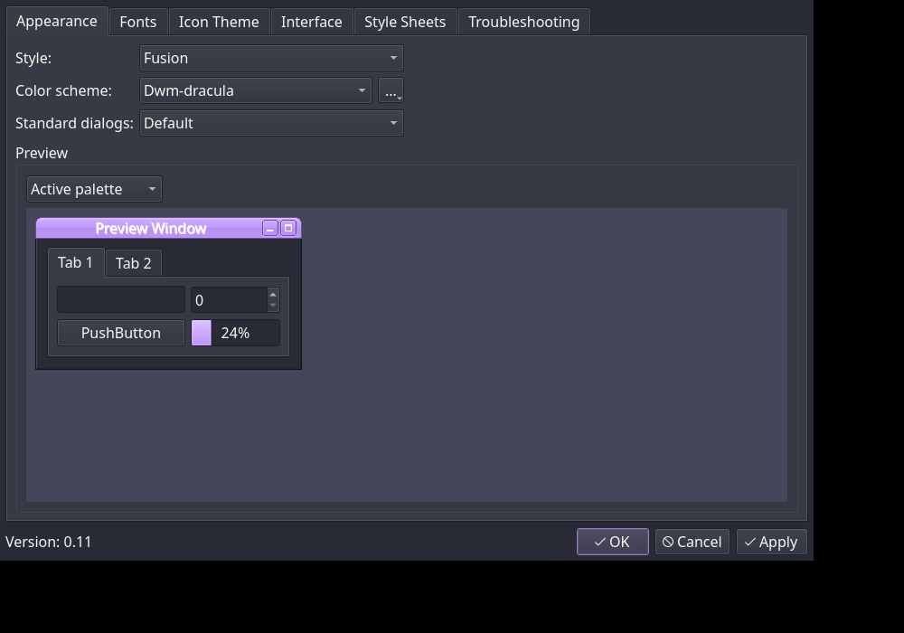

# Issue 349: application themes and light hover contrast

Validated on Fedora 44 under Xvfb. The shared shell hover surface previously
used terminal bright-black (`term_color8`) with the regular foreground. This
produced insufficient contrast in Catppuccin Latte, Gruvbox Light, Solarized
Light, Rose Pine Dawn, and Tokyo Night Day. In Solarized Light the hovered
menu label and background were both `#002B36` (1:1 contrast).

The shared shell now derives light hover surfaces from the light background.
Normal, focused, hovered, and selected control text and hovered/selected menu
text use a foreground with at least 4.5:1 contrast. Focus borders and disabled
control behavior are preserved. Dracula was checked as a dark-theme control.

Before, using the actual shared ShellButton and MenuRow components:



After:



All 15 shipped presets now have offline GTK 2/3/4 assets and a Qt palette.
These are dwm-titus palette adaptations over GTK's built-in widgets, not copies
of the upstream theme projects. Thunar with the installed Dracula palette:



Thunar with the installed Catppuccin Latte palette:



Qt6ct also loads the Dracula and Catppuccin Latte palettes, with named schemes
available from its normal selector:



The regression command exercises installed assets, GTK 3 widget states, GTK 4
CSS parsing, GTK/Qt/Alacritty/Kitty preset selection, and the actual Quickshell
Theme singleton for every preset plus a dark-to-light switch:

```sh
scripts/run-tests make check-app-themes
```

The staged install check verifies file inventory and uninstall symmetry:

```sh
scripts/run-tests make check-install
```

A clean Fedora 44 container also completed the build and staged install checks.
The shared shell was tested in nested X11 through the complete desktop suite;
closed Settings used 0.133% CPU and closed large surfaces used 0.00% CPU in
those samples. These samples do not establish behavior on untested hardware.

GTK 2 assets are installed but were not visually exercised. Qt configuration,
palette files, and qt6ct previews were checked; arbitrary third-party Qt rendering
was not exhaustively tested. Libadwaita and sandboxed apps may use only the
light/dark preference. No Fedora image boot or hardware claim is made here.
